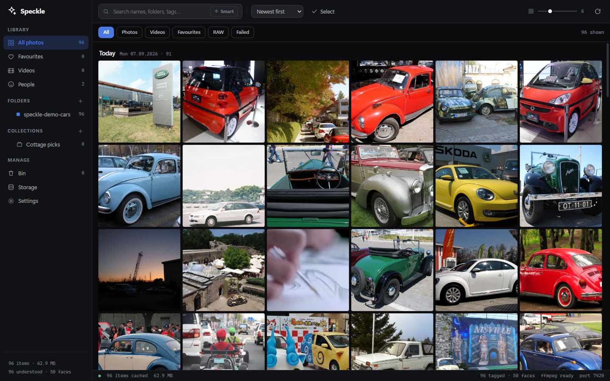
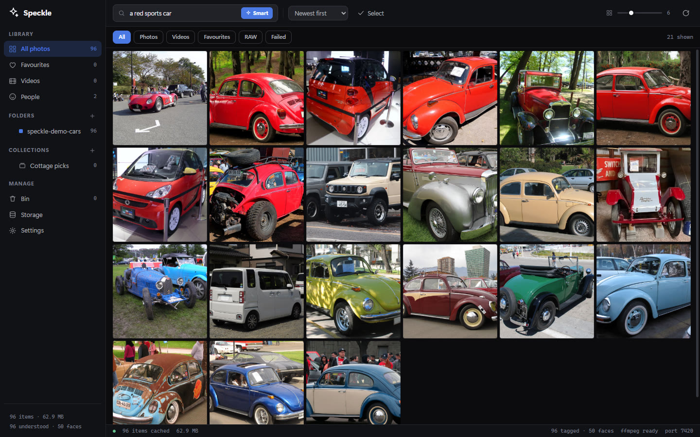
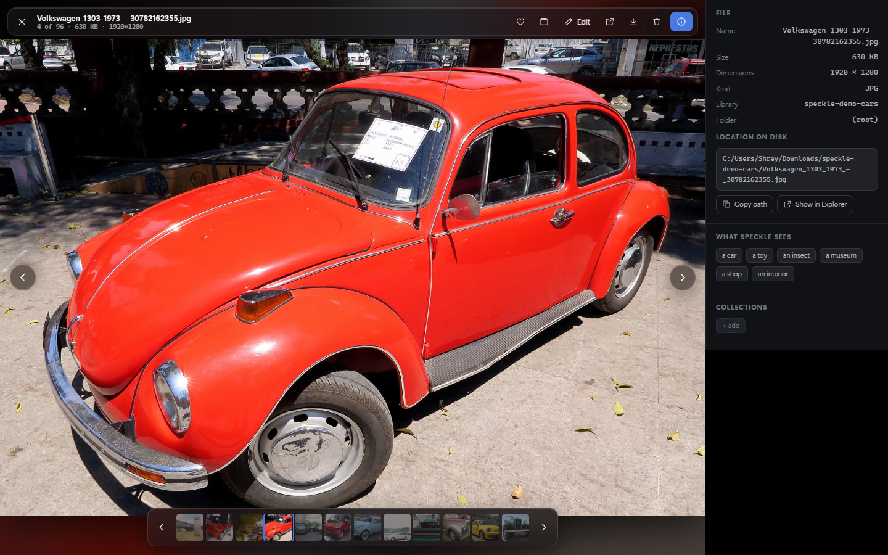
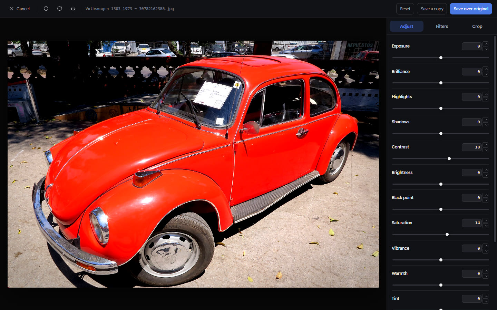
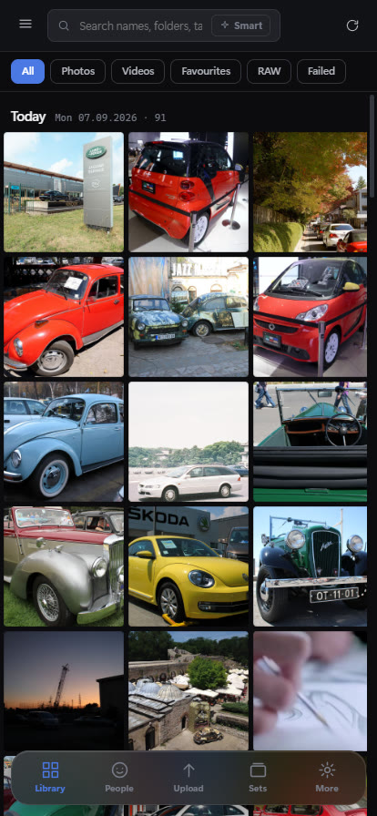
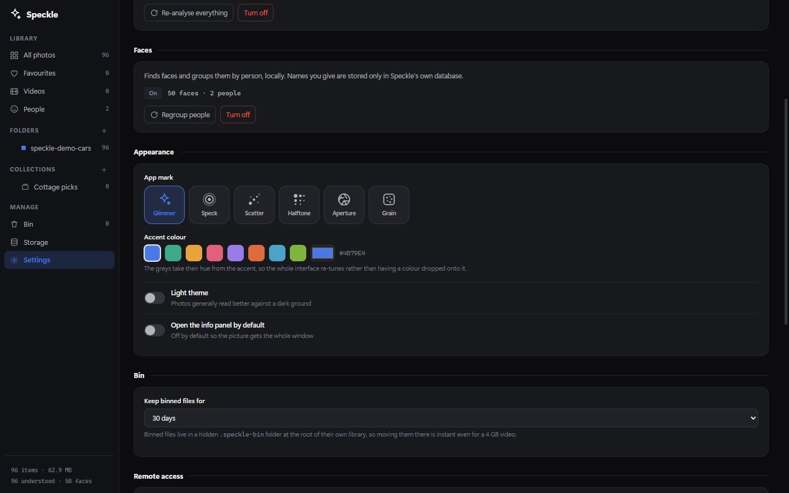

<div align="center">


# Speckle

**A fast, local-first photo and video library for Windows — and for your phone, over Tailscale.**

Point it at a folder. It indexes every sub-folder, builds a thumbnail cache, understands what
is *in* your photos, and groups the people it finds — all on your own machine, with no account,
no cloud and no telemetry.

<sub>
  Rust · axum · SQLite · WebView2 · ONNX Runtime · CLIP · InsightFace · ffmpeg
</sub>

<br>



</div>

---

## Contents

- [What it does](#what-it-does) · [Search by meaning](#search-by-meaning) · [Viewer](#viewer-and-editor)
- [Architecture](#architecture) · [Engineering notes](#engineering-notes) · [Tech stack](#tech-stack)
- [Performance](#performance) · [Install](#install) · [Build](#build-from-source)

---

## What it does

A photo library on a spinning disk is slow for one reason: opening a 40 MB RAW file to draw a
120-pixel square is absurd. Speckle does that work once, stores a 30 KB square per item, and from
then on you are scrolling a cache, not a filesystem.

|  |  |
|---|---|
| **Browsing** | Virtualised grid that stays smooth at hundreds of thousands of items. Date grouping with sticky headers, adjustable density, sort by date/name/size/shuffle, filter by kind or favourite. |
| **Search** | Type `boats` and get boats — no filenames or tags required. Runs a CLIP model locally over your library. |
| **People** | Faces are detected, embedded and clustered into people. Name them once; the name sticks. |
| **Video** | Custom transport with buffered-range scrubbing. Anything a browser cannot play is transcoded live. |
| **Editing** | 14 adjustments, 12 filter presets, crop, straighten, rotate — WebGL, with exact numeric entry. |
| **Collections** | Curated sets, like playlists. Export any set as a zip. |
| **Cleanup** | Duplicate detection, oversized-photo detection, bulk recompression — every original binned first. |
| **Remote** | The same UI on your phone over Tailscale. Upload straight from iOS into dated folders. |

---

## Search by meaning

The query below is `a red sports car`. Nothing in these filenames says "red", and no tag was ever
typed — the match is on what the pictures actually contain.



CLIP embeds every photo into a 512-dimension vector once, at about **13 photos a second on CPU
alone**. A query embeds the text into the same space and ranks by cosine similarity, which lands in
**13–76 ms** across a library. Alongside that, each photo is scored against a curated vocabulary of
~180 everyday concepts, and the strongest few become searchable tags — so plain keyword search
finds `boat` too.

> **A note on thresholds.** CLIP similarities sit in a narrow band: nearly every photo scores
> 0.20–0.30 against nearly any phrase, so an absolute cut-off keeps everything and filters nothing.
> Speckle cuts *relative to the best match* instead, with a floor to reject queries that match
> nothing at all. This is the difference between "boats" returning 49 photos and returning all 195.

---

## Viewer and editor



The frame is sized from dimensions the client already holds **before** the image is requested, so
nothing on screen moves when it arrives — and a video reloading its source to seek keeps its
footprint instead of collapsing. Neighbours are pre-decoded, so arrow keys never wait on the disk.



The editor is a single WebGL fragment shader. The pipeline that draws the live preview is the
*same code* that writes the exported JPEG — deliberately, because if preview and export ran through
different maths they would drift, and you would only discover it after overwriting a photo.

---

## On your phone

<div align="center"></div>

One responsive layout, not a second app. Add the Tailscale address to your home screen and it
behaves like a native app: swipe between photos, pinch the grid, upload from your camera roll.

---

## Architecture

```
┌──────────────────────────────────────────────────────────────┐
│  speckle.exe                                                 │
│                                                              │
│   ┌────────────┐        ┌──────────────────────────────┐     │
│   │ wry + tao  │───────▶│  axum HTTP server :7420      │     │
│   │ WebView2   │  http  │                              │     │
│   └────────────┘        │  /api/media   columnar list  │     │
│                         │  /api/thumb   SQLite blobs   │     │
│   ┌────────────┐        │  /api/search  CLIP kNN       │     │
│   │  iPhone    │───────▶│  /api/video   range + ffmpeg │     │
│   │  Safari    │tailnet └──────────────────────────────┘     │
│   └────────────┘                      │                      │
│                          ┌────────────┴────────────┐         │
│                          ▼                         ▼         │
│                  ┌───────────────┐        ┌───────────────┐  │
│                  │  index.db     │        │  thumbs.db    │  │
│                  │  metadata     │        │  JPEG blobs   │  │
│                  │  vectors      │        │  2 tiers      │  │
│                  └───────────────┘        └───────────────┘  │
│                          ▲                                   │
│         ┌────────────────┴──────────────────┐                │
│         │  background worker (never idle-spins)              │
│         │  scan → thumbnail → CLIP → faces → cluster         │
│         └───────────────────────────────────────────────────┐│
└──────────────────────────────────────────────────────────────┘
```

**One process, one API.** The desktop window is a WebView pointed at `127.0.0.1:7420` — the same
URL a phone hits over the tailnet. There is no IPC layer and no second code path for remote access,
so a feature written once works in both places or in neither.

**The pipeline is queue-driven, not event-driven.** Every stage checks for outstanding work and
claims it only when the disk is free. Adding a folder while tagging is running does not lose the
scan; it is recorded as owed and picked up when the current pass finishes. That property is why
importing a new folder needs no interaction at all — index, thumbnail, tag, detect and cluster all
happen on their own.

---

## Engineering notes

The parts that were more interesting than they look.

<details>
<summary><b>Virtualising a 250,000-item grid with correct date headers</b></summary>

<br>

The grid fetches **every** matching id, timestamp and dimension in one columnar payload rather than
paging as you scroll. Paging cannot produce an honest scrollbar or put a date header in the right
place, because neither is knowable without the whole ordered list. Columnar arrays keep this cheap:
about a megabyte on the wire at 250k items, gzipped well below that.

Layout is then pure arithmetic — group heights from item counts, row positions from a fixed tile
size — and painting diffs a `Map` of live DOM nodes against the visible window, so scrolling
neither reallocates nodes nor re-requests images.

This is also why tiles are **square**. Uniform tiles mean every cache entry is the same shape and
every row position is a multiplication. Masonry looks nicer and costs measurement per item.

</details>

<details>
<summary><b>Two thumbnail tiers, in SQLite rather than files</b></summary>

<br>

A 320 px square centre-crop is built during indexing; a 1600 px preview is built the first time a
photo is opened. Building previews eagerly would double both index time and cache size for photos
most people never open.

Both live as blobs in a SQLite database, not as loose files. At 250k items that is a quarter of a
million small files, and NTFS on a spinning disk is miserable at small-file seeks — SQLite keeps
them in a B-tree that was written in scan order, which reads sequentially.

Metadata and thumbnails are **separate databases** so that rebuilding the large, disposable cache
can never endanger the small, precious one: ratings, favourites and bin state survive a cache wipe.

</details>

<details>
<summary><b>SCRFD post-processing and ArcFace alignment</b></summary>

<br>

Face detection runs SCRFD, whose ONNX graph emits nine raw tensors — score, bounding-box and
keypoint deltas across strides 8, 16 and 32. Turning those into boxes means walking each stride's
anchor grid, decoding distances-from-centre in stride units, rescaling out of the letterbox, and
running non-maximum suppression.

Recognition then needs the face aligned to a fixed 112×112 template, so a least-squares similarity
transform is fitted from the five detected landmarks and the crop is sampled through its inverse
with bilinear filtering. Feeding ArcFace an unaligned crop roughly halves its accuracy — this step
is not optional, and it is the part most easily got subtly wrong.

Clustering is greedy agglomerative on cosine similarity at 0.42. Embeddings of the same person sit
around 0.5–0.8 apart and different people below 0.3, so a single threshold beats tuning a density
parameter, and singleton clusters are withheld from the People page rather than filling it with
strangers.

</details>

<details>
<summary><b>Video formats a browser refuses to play</b></summary>

<br>

Two thirds of a real camera roll will not play in a WebView. iPhone `.MOV` is HEVC with PCM audio;
camcorder `.AVI` is MJPEG. Rather than converting a library — slow, destructive, enormous — Speckle
re-encodes on the way out to **fragmented** MP4, which can start playing before the encode finishes
because its index does not live at the end of the file.

That stream has no index to seek within, so seeking re-requests it at an offset and the client
tracks time as `base + currentTime`. The player deliberately does *not* advertise `Accept-Ranges`
on transcoded streams: claiming range support it cannot honour makes browsers seek into nonsense.

</details>

<details>
<summary><b>Deleting is a rename</b></summary>

<br>

The bin is a hidden folder at the root of each library, so binning is a same-volume rename —
instant for a 4 GB video, and free to undo. Nothing is copied and nothing crosses a filesystem
boundary unless it has to.

This is what makes it safe to offer a button labelled *"reclaim 183 GB"*: bulk recompression moves
every original to the bin before writing its replacement, so an entire run is reversible until the
bin is emptied.

</details>

<details>
<summary><b>Reading EXIF that is slightly wrong</b></summary>

<br>

Two bugs found by pointing the indexer at a real folder rather than a synthetic one:

1. The date parser assumed EXIF's `2026:06:05` colons, but the library being used already renders
   the date with dashes — so "normalising" it corrupted the *time* instead, silently losing the
   capture date on every photo.
2. Strict parsing discarded an entire EXIF block over a single malformed tag. Plenty of real
   cameras write slightly out-of-spec EXIF; 137 of 195 test files had a perfectly good date that
   was being thrown away.

Speckle now takes partial EXIF results, falls back to scanning the header for a literal timestamp,
and finally to a date encoded in the filename (`PXL_20260607_164721605.jpg`). That took capture-date
coverage from 42/195 to 182/195 — the remainder being PNGs and AVIs, which carry no date at all.

</details>

---

## Tech stack

| Layer | Choice | Why |
|---|---|---|
| Core | **Rust** (~5,300 lines) | Fearless parallelism for the decode pipeline; one static binary |
| HTTP | **axum** + **tokio** + **tower-http** | Async server; gzip; range requests |
| Desktop shell | **wry** + **tao** (WebView2) | Native window with no bundled browser — the OS already has one |
| Storage | **SQLite** via `rusqlite`, WAL | Two databases; blob store; a tiny hand-rolled connection pool |
| Imaging | **image**, **kamadak-exif** | Decode, resize, EXIF; embedded-preview extraction for RAW and PSD |
| Parallelism | **rayon** | Decode across all cores, funnelled to a single SQLite writer |
| ML | **ONNX Runtime** via `ort`, **tokenizers** | CLIP ViT-B/32 and InsightFace `buffalo_l`, loaded dynamically on demand |
| Media | **ffmpeg** (external) | HEIC, video thumbnails, live transcoding |
| Frontend | **Vanilla JS + CSS** (~3,400 lines) | No framework, no build step, no `node_modules` — the whole UI is embedded in the exe |

The frontend genuinely has no toolchain: `cargo build` is the entire build. The UI is embedded at
compile time with `rust-embed`, which also means editing a file and refreshing is the dev loop.

---

## Performance

Measured on a Ryzen 7 5800X3D (16 threads), release build, CPU only — no GPU acceleration.

| Operation | Result |
|---|---|
| Index 195 files / 732 MB (JPEG, PNG, HEIC, PSD, MJPEG AVI, HEVC MP4) | **13 s**, zero errors |
| Serve 60 cached thumbnails | **54 ms** |
| CLIP embedding + auto-tagging | **13.4 photos/sec** |
| Face detection + embedding | **13.3 photos/sec** |
| Semantic search across a library | **13–76 ms** |
| Generate a 1600 px preview on demand | ~250 ms |
| Decode a HEIC at full resolution | ~570 ms |
| Idle memory, window open | **~29 MB** |
| Executable | **14 MB**, no installer |

At those rates a 50,000-photo library indexes in minutes and is fully understood in about an hour,
once, in the background.

---

## Formats

| Family | Path | Notes |
|---|---|---|
| JPEG, PNG, WebP, GIF, BMP, TIFF, AVIF | native Rust | served straight off disk |
| HEIC / HEIF | ffmpeg | iPhone stills; converted for display only, never on disk |
| RAW — CR2, CR3, NEF, ARW, DNG, RAF, ORF, RW2, PEF… | embedded preview | lifts the full-size JPEG inside, far cheaper than demosaicing |
| PSD, PSB | embedded preview | same trick — reads the composite |
| MP4, MOV, AVI, MKV, WebM, WMV, MTS… | ffmpeg | frame at 10% in; transcoded if the codec is unplayable |

---

## Install

Download `speckle.exe` from [Releases](../../releases) and run it. That is the whole installation —
no installer, no dependencies to register, and it can live on a USB drive.

**Recommended:** install [ffmpeg](https://ffmpeg.org/download.html) on your `PATH`. Without it,
photos work perfectly but video and HEIC do not. Speckle says so plainly in Settings.

Requires Windows 10/11 with the WebView2 runtime (ships with Windows 11).

### Where it keeps its data

Beside the executable in `speckle-data/` when writable, otherwise `%LOCALAPPDATA%\Speckle`.

```
speckle-data/
  index.db     metadata, ratings, favourites, bin state, CLIP vectors, faces
  thumbs.db    thumbnail and preview blobs
  models/      ONNX weights, downloaded only if you turn the ML features on
```

### Photo understanding and faces

Both are **opt-in** and download their models on first use — about 155 MB for search and 275 MB for
faces, plus a 72 MB runtime shared between them. After that the network is never touched again.



Once enabled, everything is automatic: import a folder, drop files in from your phone, or let a
rescan find files that appeared on disk, and the background worker indexes, tags and groups them
without being asked.

---

## Using it from your phone

Speckle prints its addresses on startup and lists them in **Settings → Remote access**:

```
[speckle] listening http://127.0.0.1:7420
[speckle] remote    http://100.x.y.z:7420        <- your tailnet address
```

Open the Tailscale address in Safari, then **Share → Add to Home Screen**.

> [!WARNING]
> **There is no password.** Anything that can reach this machine on your tailnet can view, download
> and permanently delete your photos. This is a deliberate trade for convenience on a personal
> tailnet — reconsider it if you ever share that tailnet.

---

## Build from source

Needs [Rust](https://rustup.rs) (MSVC toolchain). Nothing else.

```bash
git clone https://github.com/shreywy/Speckle
cd Speckle
cargo build --release
```

```bash
cargo run                # desktop window
cargo run -- --headless  # server only, no window
```

---

## Keyboard

| | | | |
|---|---|---|---|
| <kbd>←</kbd> <kbd>→</kbd> | Previous / next | <kbd>E</kbd> | Edit |
| <kbd>Esc</kbd> | Back | <kbd>I</kbd> | Info panel |
| <kbd>F</kbd> | Favourite | <kbd>Del</kbd> | Move to bin |
| <kbd>Space</kbd> | Play / pause | <kbd>Ctrl</kbd>+<kbd>K</kbd> | Search |
| <kbd>+</kbd> <kbd>−</kbd> | Grid density | <kbd>Ctrl</kbd>+<kbd>A</kbd> | Select all |

---

## Roadmap

- [ ] Map view from GPS EXIF
- [ ] Optional PIN for remote access
- [ ] GPU execution provider (DirectML) for the ML passes
- [ ] Side-by-side comparison in the duplicate reviewer
- [ ] Saved searches

## Licence

MIT. Screenshots use freely-licensed photographs from Wikimedia Commons, not personal ones.
